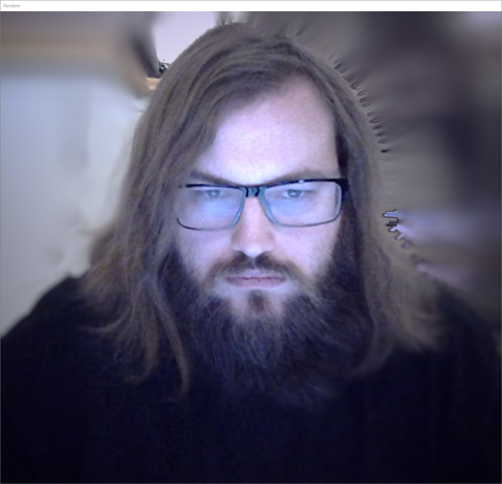

## About me

#### Most importantly:

* Name is **Dávid Mórász**
* Fully operational since 2010
* I'm a **software developer** per occupation
  * Mainly working with:
    * **C++** (Unreal, NAP)
    * **.NET** (C#, C++/CLI)
    * many tools/languages required by specific projects (see below)
* Also have minimal artistic/design background

#### Employment history

| | |
|-|-|
| **[realworld one GmbH. & Co. KG](https://realworld-one.com/)** as Senior Unreal Engineer | 2021 - 2025 |
| **[MESO Digital Interiors GmbH.](https://meso.design)** as Real-time Software Developer | 2018 - 2021 |
| **[Uberact Ltd.](https://uberact.com/)** as Lead Developer | 2014 - 2018 |
| **[Kitchen Budapest](http://kitchenbudapest.hu/)** as Media Systems Designer | 2012 - 2014 |
| **Freelance work** as Media Artist | 2009 - 2012 |

#### Contacts:

* _@mcro.de / m@mcro.de
* [Github](https://github.com/microdee)

#### Tools/Languages

Industry applicable, in order of confidence. Also assume deep knowledge of related tools.

* **C++**
  * Unreal Engine
  * Chromium Embedded Framework (CEF)
  * Graphics programming with Direct3D
  * *And necessary build tools (CMake, GN, XMake, PreMake, Meson, etc...)*
* **.NET**
  * C#
  * C++/CLI
  * XAML (WPF)
* **Tooling/Scripting**
  * Python
  * Powershell
* **[VVVV](https://vvvv.org)**

Still usable, in order of confidence

* **Webstack / Frontend**
  * Usual JS/HTML/CSS
  * Frameworks:
    * React + Redux
    * Electron.js
    * node.js
* Blender
* Unity

#### Applicable skills

* Software architecture design for complex and potentially volatile scenarios.
* Quickly learn and adopt to vast complex tools/frameworks/libraries.
* Experience with UX design: manufacturing tools focusing on ease of usage, while maintaining versatility.
* Efficiently working with teams, especially when it's assisted with infrastructure
  * Git or other version control systems
  * SCRUM/Agile project management

#### Education:

* Started computer science then media arts university, and then I didn't finish either of them.
  * BME (Budapest University of Technology and Economy)
  * MOME (Moholy Nagy University of Arts and Design)

#### Location:

* Born in Hungary, Budapest
* Currently living in Germany, Freiburg (soon to be Berlin)
