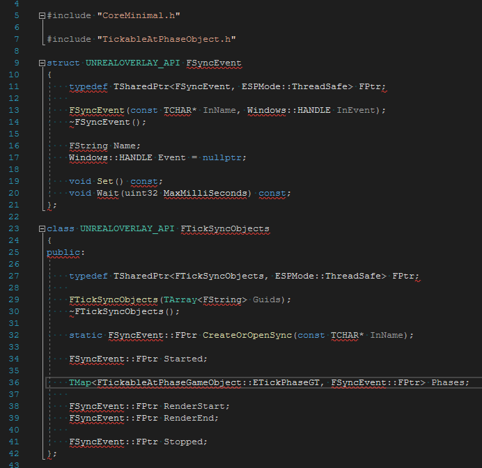

<!-- {
    "desc": "Put UE4 generated projects into CMake generated solutions"
} -->

## Useless knowledge: Put UE4 generated projects into CMake generated solutions

[(04.29.2021)](/c/log/cmake-your-ue-project)


Because god has abandoned us long ago.

This idea is actually useful when you need to debug your external service built outside of the unique snowflake UBT system for any perfectly valid reason, and test it simultaneously with your Unreal project. Or debug multiple Unreal projects inside the same solution.

Without further ado, the `CMakeLists.txt` carrying out this blasphemy:

```CMake
cmake_minimum_required(VERSION 3.17)

project(what_am_i_doing)

# other cmake shenanigans, targets, add_subdirectiories, etc ...

# include unreal test projects
include(UeProject.cmake)
include_ue_project(MyUnrealProjectName ${CMAKE_SOURCE_DIR}/PathToMyUnrealProject)
```

and inside `UeProject.cmake`

```CMake
function(include_ue_project
    UE_PROJECT_NAME
    UE_PROJECT_DIR
)
    string(REPLACE "/" "\\" UE_PROJ_DOS_DIR ${UE_PROJECT_DIR})
    set(UE_GENERATED_PROJECT_DIR "${UE_PROJECT_DIR}/Intermediate/ProjectFiles")
    set(UE_GENERATED_PROJECT_FILE "${UE_GENERATED_PROJECT_DIR}/${UE_PROJECT_NAME}.vcxproj")

    # modifying project files so UBT can work with the project regardless of where the solution file is
    file(READ ${UE_GENERATED_PROJECT_FILE} UE_GEN_PROJ_CONTENT_IN)
    string(REPLACE
        "\$(SolutionDir)"
        "${UE_PROJ_DOS_DIR}\\"
        UE_GEN_PROJ_CONTENT_OUT
        ${UE_GEN_PROJ_CONTENT_IN}
    )
    file(WRITE ${UE_GENERATED_PROJECT_FILE} ${UE_GEN_PROJ_CONTENT_OUT})

    include_external_msproject(
        ${UE_PROJECT_NAME}
        ${UE_GENERATED_PROJECT_FILE}
    )

    # map UE4 cmake configs to UE4 ones
    set_target_properties(${UE_PROJECT_NAME} PROPERTIES
        MAP_IMPORTED_CONFIG_RELEASE         Development
        MAP_IMPORTED_CONFIG_DEBUG           DebugGame
        MAP_IMPORTED_CONFIG_RELWITHDEBINFO  Development
        MAP_IMPORTED_CONFIG_MINSIZEREL      Shipping
    )

endfunction()
```

Of course, stating the obvious: generate your Unreal projects first.

For these amazing ideas CMake people were kind enough to unironically have the `include_external_msproject` function which makes this endeavor Super Easy™. As you can see you need to map the CMake conventional configurations to the UBT conventional configurations with `set_target_properties` and `MAP_IMPORTED_CONFIG_<CONFIG>`.

As you can also see, CMake modifies slightly the project file. Unreal rightfully assumes you will only use their generated projects from their generated solution, so they use `$(SolutionDir)` macro, as they should, to communicate the path to the \*.uproject. But we're doing the bidding of dark forces here so we need to replace that macro in there with `UE_PROJECT_DIR`.

This way if you include multiple Unreal projects, you can create a franken-solution out of them. So either you can debug multiple projects talking to each-other simultaneously without the need for explicit waiting for debugger code, or you just like weird things.

You will not need to include the UE4.vcxproj, but even if you want to, you might not be able to do so. The reason is that UE4.vcxproj only has one architecture-config combo: `BuiltWithUnrealBuildTool|Win32` and if you're generating your CMake project for x64 only, Visual Studio will not be able to load the project. As for reference including it would look like this:

```CMake
include_external_msproject(
    UE4
    ${UE4_PROJECT_PATH}/UE4.vcxproj
)
set_target_properties(UE4 PROPERTIES
    MAP_IMPORTED_CONFIG_RELEASE         BuiltWithUnrealBuildTool
    MAP_IMPORTED_CONFIG_DEBUG           BuiltWithUnrealBuildTool
    MAP_IMPORTED_CONFIG_RELWITHDEBINFO  BuiltWithUnrealBuildTool
    MAP_IMPORTED_CONFIG_MINSIZEREL      BuiltWithUnrealBuildTool
)
```

Also be prepared that VS intellisense will get even more confused about the UE4 code than it regularly is. Basically it will not recognize anything and will act completely retarded.



Alright now go and save the world!

<mdcomment />