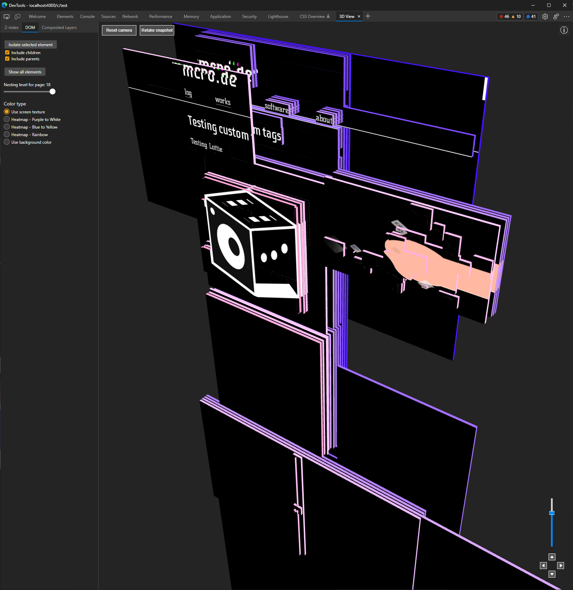

<!-- {
    "desc": "Recording some new features on this website"
} -->

# Updates! ... Again!
[(03.03.2022)](/c/log/new-website-features-2)

I've done yet another barely noticable update to my website. Barely noticable on the surface but almost a rewrite under the hood.

So until this point I was using a more than half a decade old janky template with webpack which was held together with ductape, shoelaces and feeble dreams. With this update I upgraded all old dependencies, completely got rid of the old template code, and switched to Vite. This allows me to do iterative development waay faster locally before submitting to Github pages.

Among upgrading ancient libraries, two of them caused some big restructuring: React-Router and React-Markdown, both can be worked with much elegantly than the version I was using before.

Enjoy!

<mdcomment></mdcomment>