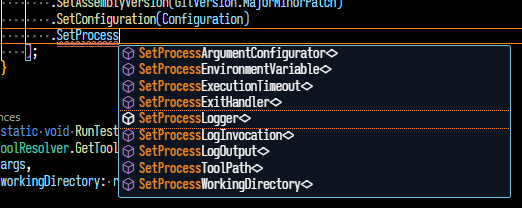
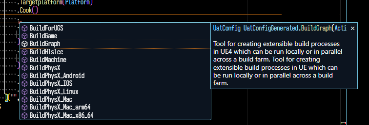

<!-- {
    "title": "Nuke.Unreal 1.2",
    "desc": "Automate the tasks involved in creating Marketplace complaint plugins and other useful scripts"
} -->

# Nuke.Unreal 1.2
[(16.05.2023)](/c/log/nuke-unreal-1-2)


<tocmd>
- [Nuke.Unreal 1.2](#nukeunreal-12)
- [UAT / UBT Configurators](#uat--ubt-configurators)
  - [Motivation](#motivation)
  - [More comments on individual tools](#more-comments-on-individual-tools)
  - [An easier interaction with UAT/UBT](#an-easier-interaction-with-uatubt)
    - [Fluent API](#fluent-api)
    - [Automatically gathered documentation](#automatically-gathered-documentation)
    - [Handling multiple egnine versions](#handling-multiple-egnine-versions)
- [Build Plugins](#build-plugins)
</tocmd>

Last time I wrote about Nuke.Unreal here was two years ago. In fact I'm not doing a great job at promoting it but that changes today! <span style="opacity: 0.66;">(and then probably it won't)</span>. In that two years a lot has changed for the better and it became much more user friendly. Just the fact that since it's available as a nuget package helps a lot, so you don't need submodules or a project template, just do

```Powershell
nuke :setup
nuke :addPackage md.Nuke.Unreal
```

in your fresh Unreal project. For the uninitiated I recommend reading the [Prelude/Reasoning](/c/log/nuke-unreal) of the article from ~2 years ago. <span style="opacity: 0.66;">(The rest of the article might have old things or plain bad advice. Tread accordingly. README.md in the main repo is the single source of truth.)</span>

Introductions aside there are several bigger things changed since then:

* Renamed targets and parameters to be more comfortable / have better alignment with Unreal namings
* Android related targets.
* as mentioned above, distributed via [Nuget package](https://www.nuget.org/packages/md.Nuke.Unreal)
* Using Nuke Tool delegates for Unreal tools instead of custom tool wrappers
* UAT and UBT C# wrappers/configurators generated from Source code analysis
* Automatically discovered build plugins

In this article I will go through them but I will first start with the UAT/UBT wrappers because they are the beefiest feature in this update,

# UAT / UBT Configurators

## Motivation

Command line tools of Unreal are not designed for human consumption, nor for letting other programs argue about their inner workings. If I have to guess they're coded fast under a lot of management pressure and without any regard to staying architecturally sound and letting a graph of single responsibility components emerge complex behaviors. Or to put it in different perspective they do have a very characteristic architecture which is however too simplistic for the scale of what both UAT and UBT accomplishes. Combining simplistic architecture with the shear amount of tasks these tools need to perform will result in the stereotipical 6000 lines long classes containing 2000 lines long functions, where the actual features and the complexity of the tools are hidden forever for everyone not determined enough to read through that wall of source code. To add salt to injury this sort of hectic flat coding style actually discourages self-documenting discoverable code and requires the responsible developer to maintain a larger article of documentation somewhere else (of course the latter doesn't usually happen with Unreal source code at least not to the degree that the uninvolved could easily understand the reasoning behind a certain wall of source code)

Now this might seem I'm roasting the code quality of UAT/UBT, but I don't mean to disrespect the work went into these programs and the engineers who done it. I'm sure they're well aware of these problems but for any very valid reason they cannot have the effort to refactor these tools to be more pleasant to work with. And they improved a lot in Unreal 5 with splitting up `DotNETUtilities` into well organized, shared and externally mountable collection of libraries (e.g.: `Epic.Core` and co.). The reason however I'm writing my second paragraph about this phenomena is that when I embarked to implement a Nice™ wrapper around these tools, their "structure" made that goal so hard, it took me 2 years of on and (mostly) off side-project development to make it work properly.

This sort of hazy internals and their inconsistent behavior also makes it very hard for the broader community to conciously use and combine the features of these tools, rather than having a sort of cargo-cult spreading of Working™ combinations of command line arguments for individual purposes. I don't claim to have a solution to this but I did want to bring a method of interacting with Unreal Tools which are more pleasant to look at, discoverable and consistent in usage.

## More comments on individual tools

Let's start with **UBT** because it was an easier nut to crack open. Simply speaking UBT had a very nice set of attributes which could clearly indicate tool-modes and their arguments. In fact originally I was using regular C# reflection to generate the tool configurator for Nuke. I actually have no complaints there regarding source code discoverability of features, other than inconsistent type visibility of arguments but that could be easily overcome with AutoMapper. The only reason I switched to source code parsing was avoiding loading multiple versions of the same assembly when gathering and merging the different features of UBT between different engine versions.

**UAT** on the other hand left no room for automatically reflecting its inner functionality just from pure reflection. It has couple of API which can fetch data from command line input, but that is scattered around the code-base and more often they're used with string literals, or worse just plain parameter input. Besides that UAT has classes for "build commands" or the highest level features you can use UAT for, and a list of common arguments which are used globally with all of the "build commands".

## An easier interaction with UAT/UBT

Nuke itself has a pattern for configuring things in a fluent way relying on nested configurator lambda functions. Like for dotnet it has

```CSharp
using static Nuke.Common.Tools.DotNet.DotNetTasks;

DotNetBuild(_ => _
    .SetNoRestore(true)
    .SetProjectFile(project)
    .SetVersion(GitVersion.NuGetVersion)
    .SetAssemblyVersion(GitVersion.MajorMinorPatch)
    .SetConfiguration(Configuration)
);
```

This way interacting with the tool is more readable and the capabilities of the tool are more discoverable.

I aspired to have similar bindings for UAT/UBT but with couple of key differences. The tool binding convention of Nuke expresses sub-tools as separate static methods (like `DotNetBuild` or `DotNetTest`), and it slightly transforms the command line logic to be more "C# friendly". See `Set<thing>`, `Enable<thing>`, `Add<thing>` methods. Also the tool binding invocation immediately executes the bound tool and it doesn't return a `Tool` delegate. Given though it gives all the features `Tool` delegate gives you via these configurator extension methods:



### Fluent API

With Unreal tool bindings I decided that the fluent API should more closely reflect the command line usage, that configurator classes should yield a string for command line arguments, and that the tool invocation function should return a `Tool` delegate which can be further configured by the caller. With these in mind cooking with UAT looks like this in Nuke.Unreal:

```CSharp
Unreal.AutomationTool(this, _ => _
    .BuildCookRun(_ => _
        .Project(ProjectPath)
        .Clientconfig(config)
        .Skipstage()
        .Manifests()
        .If(ForDistribution(), _ => _
            .Distribution()
        )
    )
    .ScriptsForProject(ProjectPath)
    .Targetplatform(Platform)
    .Cook()
    .If(InvokedTargets.Contains(BuildEditor), _ => _
        .NoCompileEditor()
    )
    .If(isAndroidPlatform, _ => _
        .Cookflavor(androidTextureMode)
    )
    .Apply(UatCook)
    .Apply(UatGlobal)
    .Append(UatArgs.AsArguments())
)("", workingDirectory: UnrealEnginePath);
```

I don't claim this is better or more readable than the traditional tool binding convention Nuke has introduced, it is more of a personal stylistic choice. Besides generating code yielding this structure seemed easier when I embarked to do this.

These methods either represent a subtool (or Build Command (in UAT) or Tool Mode (in UBT)), which will accept its own configurator method, or command line parameters/switches, where their key is the method name and their optional value is the method parameter. Now as mentioned above UBT was more structured expressing its input from command line arguments, therefore the parameters of these generated methods could have distinct types. Like numbers, strings and especially helpful enums. Supporting the same trick for UAT on the other hand was not feasible to do, as that would have needed a deeper analysis understanding intention as well surrounding the command line parser functions. So all parameters of UAT which is not a switch, has unfortunately string only parameters.

### Automatically gathered documentation

Another benefit of such a binding is to have the documentation of each subtool/switch/parameter displayed via code-completion in the IDE. Documentation is again scraped from source code either from DocFX `///` comments, or from `[Help("...")]` attributes above Build Commands of UAT.



### Handling multiple egnine versions

You might notice that the documentation here strangely repeats itself. This happens because Nuke.Unreal scapes the source of Unreal tools for multiple engine versions, and in this particular case it joins together documentation if that's different between engine versions. This is also a perfect segue to how this syntax deals with differences of the command line interface of different engine versions.

Unfortunately if one parameter or one sub-tool is renamed from one version to the next one, there's no algorithmically sound, 100% accurate way to map these renames automatically (and I wouldn't count LLM based solutions as they always have higher than 0% chance to hallucinate). With one exception of course when Unreal Engine 5 came out all mentions of `UE4` in the codebase has been renamed to `Unreal`. Nuke.Unreal can deal with that particular case, so all `Unreal*` parameters are renamed to `UE4` at invocation for Unreal Engine 4 (and where `UE4` was actually used in Unreal Engine 4).

With each parameter or subtool an extra metadata is kept denoting which engine versions they're compatible with. If the developer would invoke a parameter which is not present in their target engine version, that will be ignored from the resulting command line arguments string and a warning will be logged.

# Build Plugins

Nuke.Unreal 1.2 brought with it a separated utilities library for Nuke, which now lives on its own and doesn't concern Unreal at all. It's called [Nuke.Cola](https://github.com/microdee/md.Nuke.Cola). It brings couple of usability features which makes composing builds slightly less of a chore. One of them which is done especially for preparing independent Unreal plugins is its feature called "Build Plugins".

These plugins are independent C# scripts or dotnet projects which declare one or more [Build Components](https://nuke.build/docs/sharing/build-components/) which can tap into the Nuke execution graph of the main project. Nuke.Cola gives the facilities to discover these plugins in runtime and compile an intermediate build class inheriting from these discovered build components.

The reasoning behind this is that the main project's Nuke scripts or the pre-built independently distributed build-tools shouldn't explicitly know about the plugin composition of the project they need to work on in runtime. Unreal, or other non-dotnet project models might not have the capacity or cultural acceptance to rely on a Nuget infrastructure to distribute build scripts of these independent software components, which then could be referenced by the main project.

Even if that would be plausable it would still take uncomfortable extra boilerplate for each of these software components to cater for a centralized build script. In case of a pre-built tool based on a Nuke build script, this is the only way I know of to have dynamically composable software component specific build scripts considered.

There are multiple ways to set these up:

* [Standalone C# files, compiled with the build project](https://github.com/microdee/md.Nuke.Cola?tab=readme-ov-file#implicitbuildinterface-plugins) <span style="opacity: 0.66;">(added 2024 october)</span>
  * This is the easiest to configure and needs the least amount of boilerplate.
* [Standalone single file CSX scripts](https://github.com/microdee/md.Nuke.Cola?tab=readme-ov-file#nukecsx-c-script-plugins)
  * This needs slightly more boilerplate and it doesn't automatically know about the main project's classes
* [Full dotnet projects](https://github.com/microdee/md.Nuke.Cola?tab=readme-ov-file#nukecsproj-c-project-plugins)
  * This has the most boilerplate but is the more traditional approach to C# development.

All of them are fully supported by IDE's.

In all cases to make them truly local `Nuke.Cola` provides the `ScriptFolder()` extension method, which is simply a wrapper around `[CallerFilePath]` C# compiler service.

<mdcomment></mdcomment>