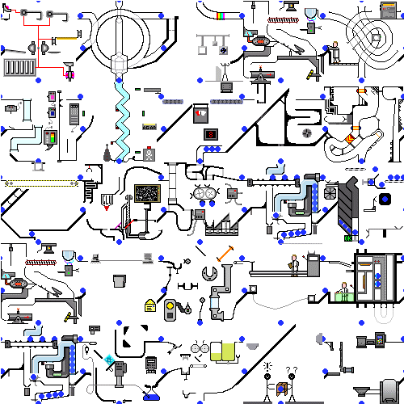

<!-- {
    "desc": "Info about Rendering Dependency Graph"
} -->

# Rendering Dependency Graph
[(04.07.2021)](/c/log/rdg)

Unreal Engine has a nice graphics development framework, going in tandem with **RHI** (**R**endering **H**ardware **I**nterface) called **RDG** (**R**endering **D**ependency **G**raph). I've collected couple of resources about it scattered around and put them in a nice long article, which has code as text, and because it's public, search engines can find it.

In a nutshell RDG greatly simplifies shader binding with your C++ code, and leverages resource lifespan management off the developer, by building a graph of passes depending or yielding these resources. This way it reduces boilerplate code usually associated with developing graphics pipeline.

## [Go to the article](/c/rdg)

Useful links:

* [Official article](https://docs.unrealengine.com/en-US/ProgrammingAndScripting/Rendering/RenderDependencyGraph/index.html)
* [RDG 101: A Crash Course](https://epicgames.ent.box.com/s/ul1h44ozs0t2850ug0hrohlzm53kxwrz)