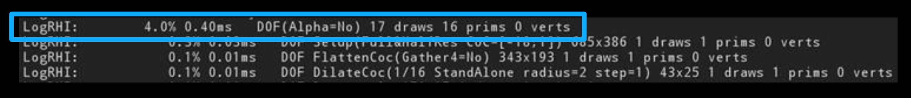

<!-- {
    "desc": "Info about Rendering Dependency Graph"
} -->

# Rendering Dependency Graph


<tocmd>
- [Rendering Dependency Graph](#rendering-dependency-graph)
  - [RenderGraph.h](#rendergraph-h)
  - [Code snippets from RDG 101:](#code-snippets-from-rdg-101)
    - [Shader Parameters](#shader-parameters)
      - [Shader Parameter Structs](#shader-parameter-structs)
      - [Compile-Time Reflection Metadata](#compile-time-reflection-metadata)
      - [Automatic Parameter Alignment](#automatic-parameter-alignment)
      - [First Shader Class (inline)](#first-shader-class-inline)
      - [Assigning Parameters](#assigning-parameters)
      - [Defining a Uniform Buffer](#defining-a-uniform-buffer)
      - [Include Uniform Buffers in Shader Parameter Structs](#include-uniform-buffers-in-shader-parameter-structs)
    - [Render Graph Basics](#render-graph-basics)
      - [The Render Graph Builder](#the-render-graph-builder)
      - [Creating a Texture](#creating-a-texture)
      - [Creating a UAV for a Texture](#creating-a-uav-for-a-texture)
      - [Creating an SRV for a Texture](#creating-an-srv-for-a-texture)
      - [Pass Parameters](#pass-parameters)
      - [Add a Pass](#add-a-pass)
      - [Render Target Bindings Slots](#render-target-bindings-slots)
      - [Binding a Color Render Target](#binding-a-color-render-target)
      - [Binding Depth Stencil Target](#binding-depth-stencil-target)
      - [Binding UAVs for Pixel Shaders](#binding-uavs-for-pixel-shaders)
      - [Registration](#registration)
      - [Extraction Queries](#extraction-queries)
      - [Creating Buffers](#creating-buffers)
      - [Reading from a Buffer Using an SRV](#reading-from-a-buffer-using-an-srv)
      - [Indirect Draw/Dispatch  Buffer](#indirect-draw-dispatch-buffer)
    - [Pass Debugging and Methodology](#pass-debugging-and-methodology)
      - [VisualizeTexture Integration](#visualizetexture-integration)
      - [-rdgimmediate](#rdgimmediate)
      - [Early Validation of Shader Parameters](#early-validation-of-shader-parameters)
      - [-rdgdebug](#rdgdebug)
      - [Dependency Methodology](#dependency-methodology)
      - [Repetitive AddPass Pattern](#repetitive-addpass-pattern)
      - [GPU Debugging UAV Trick](#gpu-debugging-uav-trick)
      - [Need More than 4 Channels in a Texture?](#need-more-than-4-channels-in-a-texture)
      - [Resource Structure Setup](#resource-structure-setup)
      - [Flexible Structure Nesting](#flexible-structure-nesting)
      - [Structure Arrays](#structure-arrays)
      - [Event Scopes](#event-scopes)
      - [GPU Timing Aggregation](#gpu-timing-aggregation)
    - [Screen Pass Framework](#screen-pass-framework)
      - [Texture Viewports](#texture-viewports)
      - [Understanding Texture Viewports](#understanding-texture-viewports)
      - [Texture Viewport Parameters](#texture-viewport-parameters)
      - [Texture Viewport Parameter Setup](#texture-viewport-parameter-setup)
      - [Defining in the shader](#defining-in-the-shader)
      - [Draw Screen Pass API](#draw-screen-pass-api)
      - [Transform UV’s Between Viewports](#transform-uv-s-between-viewports)
  - [Discussion](#discussion)
</tocmd>

If you have any comments or insights [please tell us!](#discussion)

Useful links:

* [Official article](https://docs.unrealengine.com/en-US/ProgrammingAndScripting/Rendering/RenderDependencyGraph/index.html)
* [RDG 101: A Crash Course](https://epicgames.ent.box.com/s/ul1h44ozs0t2850ug0hrohlzm53kxwrz)

## RenderGraph.h

Contents of `Engine/Source/Runtime/RenderCore/Public/RenderGraph.h` which provides an overview of the **Rendering Dependency Graph** framework in UE4. It's not the same as the official article in UE4 docs, and contains much more useful information.

Rendering Dependency Graph framework to setup lambda scopes designed as passes to issue GPU commands to the RHI through a deferred execution. They are created with `FRDGBuilder::AddPass()`. When creating a pass, it needs to have shader parameters. Can be any shader parameters, but the framework is mostly interested about the render graph resources.

The structure that hold all the pass parameter should be allocated using `FRDGBuilder::AllocParameters()` to ensure correct lifetime due to the lambda's execution being deferred.

A render graph resource, created with `FRDGBuilder::CreateTexture()` or `FRDGBuilder::CreateBuffer()`, only record the resource descriptor. Allocation will be done by the graph if/when the resource is needed. The graph will track the resource's lifetime and can free and reuse the memory when the remaining passes no longer reference it.

All render graph resources used in a pass, must be in the parameters of pass given on the `FRDGBuilder::AddPass()`. It allows render graph to know what resource are being used by a given pass. The resources are only guaranteed to be allocated when executing passes. Therefore accessing them should only done within the lambda scope of the pass created with `FRDGBuilder::AddPass()`. Failing to list some resource used by the pass may result in problems.

It is important to not reference more graph resources in the parameters than a pass needs, since this artificially increases the graphs knowledge of that resource's lifetime. This can cause an increase in memory use or prevent passes from overlapping their execution. An example is `ClearUnusedGraphResources()` that can automatically null out resource references unused by a shader for passes that have only on shader. Warnings will be emitted if a resource is not used in a pass (thanks to `FRDGResource::MarkResourceAsUsed()`)

The lambda scope of a pass execution may happen any time after `FRDGBuilder::AddPass()`. For debugging purpose, it may happen directly in the `AddPass()` with the immediate mode. When a bug is happening during pass execution, immediate mode allows you to have the callstack of the pass setup that may have the source cause of the bug. The immediate mode can be enabled from command line with `-rdgimmediate`, or with the cvar `r.RDG.ImmediateMode=1`.

Pooled managed resource texture `FPooledRenderTarget` generated by legacy code can be used in render graph by using `FRDGBuilder::RegisterExternalTexture()`.

With the knowledge of pass dependencies, the execution may prioritize different hardware goal, such as prioritizing memory pressure or pass GPU execution concurrency. As such, the execution order of passes is not guaranteed. The execution order of the pass only guarantees that the execution will perform the work on the intermediary resource exactly as the immediate mode does on the GPU.

A render graph pass should not modify the state of an external data structure, as this may lead to edge cases according to the execution order of the pass. Render graph resources that should survive the render graph execution (For instance, a
viewport back buffer, temporal AA history for next frame...) should be extracted using
`FRDGBuilder::QueueTextureExtraction()`. If a pass is detected not useful to produce any of this resources scheduled for extraction, or modifying an external texture, this pass may not even be executed with a warning ***(TODO)***.

Unless exception motivated with strong technical reasons (like stereo rendering rendering multiple views at once for VR), do not bundle multiple work on different resources in the same pass. This will end up creating more dependencies on a bundle of work that individually may only require a subset of those dependencies. The scheduler may be able to overlap a part of that with other GPU work. This may also retain allocated transient resources longer, potentially increasing highest memory pressure peak of your entire frame.

Although the `AddPass()` only wants a lambda scope to have deferred execution, it does not mean you nead to write one. A pass may already be fully implementable using an even simpler utility such as the ones in `FComputeShaderUtils` or `FPixelShaderUtils`.

## Code snippets from RDG 101:

Does anybody know if there's an actual lecture going with these slides?

The following is a 99.9% 1:1 transcript of the RDG 101 presentation slides. The remaining 0.1% is couple of stylistic choices (use `Params` instead of `Parameters`), use `auto` where it makes sense (because we're not living in 1998 anymore.) and use implicit captures for lambdas to save some space.

**Besides, couple of personal notes:**

Most of the headers and types the author referenced in this presentation are private engine headers and types (such as `FScreenPassTextureViewportParameters`). These are not exported publicly, which is super annoying to say the least because some functionality in there would be extremely useful for 3rd party plugins.

If you want to introduce your own screen passes in-between or after vanilla screen passes for a viewport, you can use `FSceneViewExtensionBase`. It comes with great potential AND it even gives you an `FRDGBuilder` in `PrePostProcessPass_RenderThread` or in `SubscribeToPostProcessingPass`. Unfortunately other than the latter, a plugin developer has no further control or insight into the graph exposed with these scene-view-extensions, which I find puzzling to be frank, as working with RDG results in so much readable and maintainable code than just working with your classic RHI workflow.

But without further ado:

### Shader Parameters

#### Shader Parameter Structs

```Cpp
BEGIN_SHADER_PARAMETER_STRUCT(FMyShaderParameters, MODULE_API)
    SHADER_PARAMETER(FVector2D, ViewportSize)
    SHADER_PARAMETER(FVector4, Hello)
    SHADER_PARAMETER(float, World)
    SHADER_PARAMETER_ARRAY(FVector, FooBarArray, [16])
    
    SHADER_PARAMETER_TEXTURE(Texture2D, BlueNoiseTexture)
    SHADER_PARAMETER_SAMPLER(SamplerState, BlueNoiseSampler)

    SHADER_PARAMETER_TEXTURE(Texture2D, SceneColorTexture)
    SHADER_PARAMETER_SAMPLER(SamplerState, SceneColorSampler)

    SHADER_PARAMETER_UAV(RWTexture2D<float4>, SceneColorTexture)
END_SHADER_PARAMETER_STRUCT()
```

#### Compile-Time Reflection Metadata

```Cpp
const FShaderParametersMetadata* ParametersMetadata = FMyShaderParameters::FTypeInfo::GetStructMetadata();
```

See `FShaderParametersMetadata::FMember` for more information.

#### Automatic Parameter Alignment

```Cpp
BEGIN_SHADER_PARAMETER_STRUCT(FMyShaderParameters, MODULE_API)  // 16 bytes aligned.
    SHADER_PARAMETER(FVector2D, ViewportSize)                   // 2 x 4 bytes
    // PADDING                                                  // PADDING 2 x 4 bytes
    SHADER_PARAMETER(FVector4, Hello)                           // 4 x 4 bytes
    SHADER_PARAMETER(float, World)                              // 1 x 4 bytes
    // PADDING                                                  // PADDING 3 x 4 bytes
    SHADER_PARAMETER_ARRAY(FVector, FooBarArray, [16])          // 4 x 4 x 16 bytes
    
    SHADER_PARAMETER_TEXTURE(Texture2D, BlueNoiseTexture)       // 8 bytes
    SHADER_PARAMETER_SAMPLER(SamplerState, BlueNoiseSampler)    // 8 bytes

    SHADER_PARAMETER_TEXTURE(Texture2D, SceneColorTexture)      // 8 bytes
    SHADER_PARAMETER_SAMPLER(SamplerState, SceneColorSampler)   // 8 bytes

    SHADER_PARAMETER_UAV(RWTexture2D<float4>, SceneColorTexture)          // 8 bytes
END_SHADER_PARAMETER_STRUCT()
```

↓↓↓↓↓

```Cpp
BEGIN_SHADER_PARAMETER_STRUCT(FMyShaderParameters, MODULE_API)  // 16 bytes aligned.
    SHADER_PARAMETER(FVector2D, ViewportSize)                   // 2 x 4 bytes
    SHADER_PARAMETER(float, World)                              // 1 x 4 bytes
    // PADDING                                                  // PADDING 1 x 4 bytes
    SHADER_PARAMETER(FVector4, Hello)                           // 4 x 4 bytes
    SHADER_PARAMETER_ARRAY(FVector, FooBarArray, [16])          // 4 x 4 x 16 bytes
    
    SHADER_PARAMETER_TEXTURE(Texture2D, BlueNoiseTexture)       // 8 bytes
    SHADER_PARAMETER_SAMPLER(SamplerState, BlueNoiseSampler)    // 8 bytes

    SHADER_PARAMETER_TEXTURE(Texture2D, SceneColorTexture)      // 8 bytes
    SHADER_PARAMETER_SAMPLER(SamplerState, SceneColorSampler)   // 8 bytes

    SHADER_PARAMETER_UAV(RWTexture2D<float4>, SceneColorTexture)          // 8 bytes
END_SHADER_PARAMETER_STRUCT()
```

#### First Shader Class (inline)

```Cpp
class FMyShaderCS : public FGlobalShader
{
    DECLARE_GLOBAL_SHADER(FMyShaderCS); // [1]

    //====================================================================
    SHADER_USE_PARAMETER_STRUCT(FMyShaderCS, FGlobalShader);
    //--------------------------------------------------------------------

    static bool ShouldCompilePermutation(const FGlobalShaderPermutationParameters& Parameters)
    {
        return GMaxRHIShaderPlatform == SP_PCD3D_SM5;
    }

    //====================================================================
    BEGIN_SHADER_PARAMETER_STRUCT(FParameters, )
        SHADER_PARAMETER(FVector2D, ViewportSize)
        SHADER_PARAMETER(FVector4, Hello)
        SHADER_PARAMETER(float, World)
        SHADER_PARAMETER_ARRAY(FVector, FooBarArray, [16])
        
        SHADER_PARAMETER_TEXTURE(Texture2D, BlueNoiseTexture)
        SHADER_PARAMETER_SAMPLER(SamplerState, BlueNoiseSampler)

        SHADER_PARAMETER_TEXTURE(Texture2D, SceneColorTexture)
        SHADER_PARAMETER_SAMPLER(SamplerState, SceneColorSampler)

        SHADER_PARAMETER_UAV(RWTexture2D<float4>, SceneColorTextureRW)
    END_SHADER_PARAMETER_STRUCT()
    //--------------------------------------------------------------------
}
```

1. `DECLARE_GLOBAL_SHADER` and `DEFINE_GLOBAL_SHADER` works only inside engine sources despite the fact that they just `#define DECLARE_GLOBAL_SHADER(Shader) DECLARE_SHADER_TYPE(Shader, Global)`. Use `DECLARE_SHADER_TYPE` and its definition explicitly.

#### Assigning Parameters

```Cpp
//====================================================================
FMyShaderCS::FPermutationDomain PermutationVector;
FMyShaderCS::FParameters ShaderParameters;
ShaderParameters.ViewportSize = View.ViewRect.Size();
ShaderParameters.World = 1.0f;
ShaderParameters.FooBarArray[4] = {1.0f, 0.5f, 0.5f};
//--------------------------------------------------------------------

TShaderMapRef<FMyShaderCS> ComputeShader(View.ShaderMap, PermutationVector);
RHICmdList.SetComputeShader(ShaderRHI);

//====================================================================
SetShaderParameters(RHICmdList, *ComputeShader, ComputeShader->GetComputeShader(), Parameters);
//--------------------------------------------------------------------

RHICmdList.DispatchComputeShader(GroupCount.X, GroupCount.Y, GroupCount.Z);

UnsetShaderUAVs(RHICmdList, *ComputeShader, ComputeShader->GetComputeShader());
```

#### Defining a Uniform Buffer

```Cpp
BEGIN_GLOBAL_SHADER_PARAMETER_STRUCT(FSceneTextureUniformParameters, RENDERER_API)
	// Scene Color / Depth
	SHADER_PARAMETER_RDG_TEXTURE(Texture2D, SceneColorTexture)
    SHADER_PARAMETER_SAMPLER(SamplerState, SceneColorTextureSampler)
	SHADER_PARAMETER_RDG_TEXTURE(Texture2D, SceneDepthTexture)
    SHADER_PARAMETER_SAMPLER(SamplerState, SceneDepthTextureSampler)
	SHADER_PARAMETER_RDG_TEXTURE(Texture2D<float>, SceneDepthTextureNonMS)

	// GBuffer
	SHADER_PARAMETER_RDG_TEXTURE(Texture2D, GBufferATexture)
	SHADER_PARAMETER_RDG_TEXTURE(Texture2D, GBufferBTexture)
	SHADER_PARAMETER_RDG_TEXTURE(Texture2D, GBufferCTexture)
	SHADER_PARAMETER_RDG_TEXTURE(Texture2D, GBufferDTexture)
	SHADER_PARAMETER_RDG_TEXTURE(Texture2D, GBufferETexture)
	SHADER_PARAMETER_RDG_TEXTURE(Texture2D, GBufferFTexture)
	SHADER_PARAMETER_RDG_TEXTURE(Texture2D, GBufferVelocityTexture)

	// ...
END_GLOBAL_SHADER_PARAMETER_STRUCT()
```

```Cpp
IMPLEMENT_GLOBAL_SHADER_PARAMETER_STRUCT(FSceneTextureUniformParameters, /* ! */ "SceneTextureStruct");
```

```HLSL
// Generated file that contains uniform buffer declarations needed by the shader being compiled
#include "/Engine/Generated/GeneratedUniformBuffers.ush"
```

```HLSL
return Texture2DSampleLevel(
    /* ! */ SceneTextureStruct.SceneColorTexture,
    /* ! */ SceneTextureStruct.SceneColorTextureSampler,
    ScreenUV, 0
).rgb;
```

#### Include Uniform Buffers in Shader Parameter Structs

```Cpp
    BEGIN_SHADER_PARAMETER_STRUCT(FParameters, )
        // ...
        SHADER_PARAMETER_STRUCT_REF(FViewUniformShaderParameters, ViewUniformBuffer)
    END_SHADER_PARAMETER_STRUCT()
```

```Cpp
FMyShaderCS::FParameters ShaderParameters;
ShaderParameters.ViewportSize = View.ViewRect.Size();
ShaderParameters.World = 1.0f;
ShaderParameters.FooBarArray[4] = {1.0f, 0.5f, 0.5f};
//====================================================================
ShaderParameters.ViewUniformBuffer = View.ViewUniformBuffer;
//--------------------------------------------------------------------
```

### Render Graph Basics

#### The Render Graph Builder

```Cpp
FRDGBuilder GraphBuilder(RHICmdList);

// Setup your rendering graph here.

GraphBuilder.Execute()
```

#### Creating a Texture

```Cpp
FRDGTextureDesc SceneColorDesc = FRDGTextureDesc::Create2DDesc(
    {1920, 1080},
    PF_FloatRGBA,
    FClearValueBinding::Black,
    /* InFlags = */           TexCreate_None,
    /* InTargetableFlags = */ TexCreate_ShaderResource | TexCreate_RenderTargetable | TexCreate_UAV
    /* bInForceSeparateTargetAndShaderResource */ false
);

FRDGTexture* SceneColor = GraphBuilder.CreateTexture(SceneColorDesc, TEXT("SceneColor"));
```

Descriptor of a graph tracked texture:

```Cpp
using FRDGTextureDesc = FPooledRenderTargetDesc;
```

#### Creating a UAV for a Texture

```Cpp
FRDGTextureUAV* SceneColorUAV = GraphBuilder.CreateUAV({SceneColor, /* Mip = */ 0});
```

#### Creating an SRV for a Texture

```Cpp
FRDGTextureSRVRef SceneColorSRV = GraphBuilder.CreateSRV({SceneColor, /* Mip = */ 0});
```

#### Pass Parameters

```Cpp
BEGIN_SHADER_PARAMETER_STRUCT(FParameters, )
    SHADER_PARAMETER_TEXTURE(Texture2D, BlueNoiseTexture)
    SHADER_PARAMETER_SAMPLER(SamplerState, BlueNoiseSampler)

    //====================================================================
    // SHADER_PARAMETER_TEXTURE(Texture2D, SceneColorTexture)
    SHADER_PARAMETER_RDG_TEXTURE(Texture2D, SceneColorTexture)
    //--------------------------------------------------------------------

    SHADER_PARAMETER_SAMPLER(SamplerState, SceneColorSampler)

    //====================================================================
    // SHADER_PARAMETER_UAV(RWTexture2D<float4>, SceneColorTextureRW)
    SHADER_PARAMETER_RDG_TEXTURE_UAV(RWTexture2D<float4>, SceneColorTextureRW)
    //--------------------------------------------------------------------

END_SHADER_PARAMETER_STRUCT()
```

#### Add a Pass

```Cpp
TShaderMapRef<FMyShaderCS> ComputeShader(View.ShaderMap, FMyShaderCS::FPermutationDomain());

// alloc with GraphBuilder //
auto PassParams = GraphBuilder.AllocParameters<FMyShaderCS::FParameters>();
// ...

// setup params //
PassParams->SceneColorTexture = SceneColor;
PassParams->SceneColorSampler = TStaticSamplerState<SF_Point, AM_Clamp, AM_Clamp>::GetRHI();
PassParams->SceneColorOutput = GraphBuilder.CreateUAV(NewSceneColor);

GraphBuilder.AddPass(
    RDG_EVENT_NAME("MyShader %dx%d", View.ViewRect.Width(), View.ViewRect.Height()),
    PassParams, // <- associate to pass //
    ERenderGraphPassFlags::Compute,

    // Pass execution lambda function //
    [=](FRHICommandList& RHICmdList)
    {
        FComputeShaderUtils::Dispatch(RHICmdList, ComputeShader, *PassParams, GroupCount)
    }
)
```

#### Render Target Bindings Slots

```Cpp
class FTemporalAAPS : public FGlobalShader
{
    DECLARE_GLOBAL_SHADER(FTemporalAAPS); // [1]
    SHADER_USE_PARAMETER_STRUCT(FTemporalAAPS, FGlobalShader);

    // ...

    BEGIN_SHADER_PARAMETER_STRUCT(FParameters, )
        SHADER_PARAMETER_STRUCT_INCLUDE(FTAAShaderParameters, CommonParameters)

        //====================================================================
        RENDER_TARGET_BINDING_SLOTS()
        //--------------------------------------------------------------------

    END_SHADER_PARAMETER_STRUCT()
}
```

1. `DECLARE_GLOBAL_SHADER` and `DEFINE_GLOBAL_SHADER` works only inside engine sources despite the fact that they just `#define DECLARE_GLOBAL_SHADER(Shader) DECLARE_SHADER_TYPE(Shader, Global)`. Use `DECLARE_SHADER_TYPE` and its definition explicitly.

#### Binding a Color Render Target

```Cpp
auto PassParams = GraphBuilder.AllocParameters<FTemporalAAPS::FParameters>();
PassParams->CommonParameters = CommonShaderParameters;
PassParams->RenderTargets[0] = FRenderTargetBinding {
    Outputs.SceneColor,
    ERenderTargetLoadAction::ENoAction,
    ERenderTargetStoreAction::EStore
};

if (Outputs.SceneMetadata)
{
    PassParams->RenderTargets[1] = FRenderTargetBinding {
        Outputs.SceneColor,
        ERenderTargetLoadAction::ENoAction,
        ERenderTargetStoreAction::EStore
    };
}

```

#### Binding Depth Stencil Target

```Cpp
PassParams->RenderTargets.DepthStencil = FDepthStencilBinding {
    SceneBlackboard.SceneDepthBuffer,
    ERenderTargetLoadAction::ENoAction, ERenderTargetStoreAction::ENoAction,
    ERenderTargetLoadAction::ELoad,     ERenderTargetStoreAction::EStore,
    FExclusiveDepthStencil::DepthRead_StencilWrite
};
```

#### Binding UAVs for Pixel Shaders

```Cpp
BEGIN_SHADER_PARAMETER_STRUCT(FParameters, )
    SHADER_PARAMETER_STRUCT_INCLUDE(FTAAShaderParameters, CommonParameters)

    //====================================================================
    SHADER_PARAMETER_RDG_TEXTURE_UAV(RWTexture2D<float4>, MyOutUAV)
    SHADER_PARAMETER_RDG_TEXTURE_UAV(RWTexture2D<float4>, MyOtherOutUAV)
    //--------------------------------------------------------------------

    RENDER_TARGET_BINDING_SLOTS()
END_SHADER_PARAMETER_STRUCT()
```

#### Registration

```Cpp
TRefCountPtr<IPooledRenderTarget> RawSceneColorPtr = /***/;

auto SceneColor = GraphBuilder.RegisterExternalTexture(RawSceneColorPtr, TEXT("SceneColor"));
```

Check out `GRenderTargetPool.CreateUntrackedElement()` to get a `TRefCountPtr<IPooledRenderTarget>` if need to register a different from RHI resource (for instance the very old `FRenderTarget`)

#### Extraction Queries

```Cpp
auto TAAOut = GraphBuilder.CreateTexture(/* bla bla bla */);

// All the things making TAA possible

TRefCountPtr<IPooledRenderTarget> TAAHistory;
GraphBuilder.QueueTextureExtraction(TAAOut, &TAAHistory);

// ...

check(!TAAHistory);

GraphBuilder.Execute();

check(TAAHistory);
```

#### Creating Buffers

```Cpp
auto IndirectArgBufferDesc = FRDGBufferDesc::CreateIndirectDesc<FRHIDrawIndexedIndirectParameters>(/* NumElements = */2);
auto DrawListDescs = FRDGBufferDesc::CreateStructuredDesc(
    sizeof(float) * 4, 5 * MaxScatteringGroupCount
);
FRDGBuffer* DrawIndeirectParametersBuffer = GraphBuilder.CreateBuffer(IndirectArgBufferDesc, TEXT("DOFIndirectDrawParameters"));
FRDGBuffer* ForegroundScatterDrawListBuffer = GraphBuilder.CreateBuffer(DrawListDescs, TEXT("DOFForegroundDrawList"));
FRDGBuffer* BackgroundScatterDrawListBuffer = GraphBuilder.CreateBuffer(DrawListDescs, TEXT("DOFBackgroundDrawList"));
```

**...**

```Cpp
PassParameters->OutScatterDrawIndirectParameters = GraphBuilder.CreateUAV(DrawIndeirectParametersBuffer);
if(ForegroundScatterDrawListBuffer)
    PassParameters->OutForegroundScatterDrawList = GraphBuilder.CreateUAV(ForegroundScatterDrawListBuffer);
if(BackgroundScatterDrawListBuffer)
    PassParameters->OutBackgroundScatterDrawList = GraphBuilder.CreateUAV(BackgroundScatterDrawListBuffer);
```

#### Reading from a Buffer Using an SRV

```Cpp
BEGIN_SHADER_PARAMETER_STRUCT(FDOFHybridScatterParameters, )
    SHADER_PARAMETER_RDG_BUFFER(Buffer<uint>, IndirectDrawParameter)

    //====================================================================
    SHADER_PARAMETER_RDG_BUFFER_SRV(StructuredBuffer<float4>, ScatterDrawList)
    //--------------------------------------------------------------------

    // [...]
END_SHADER_PARAMETER_STRUCT()
```

**...**

```Cpp
auto PassParams = GraphBuilder.AllocParameters<FDOFHybridScatterParameters>();
PassParams->IndirectDrawParameter = DrawIndeirectParametersBuffer;

//====================================================================
PassParams->ScatterDrawList = GraphBuilder.CreateSRV(ScatterDrawList);
//--------------------------------------------------------------------
```

#### Indirect Draw/Dispatch  Buffer


```Cpp
BEGIN_SHADER_PARAMETER_STRUCT(FDOFHybridScatterParameters, )

    //====================================================================
    SHADER_PARAMETER_RDG_BUFFER(Buffer<uint>, IndirectDrawParameter)
    //--------------------------------------------------------------------

    SHADER_PARAMETER_RDG_BUFFER_SRV(StructuredBuffer<float4>, ScatterDrawList)
    // [...]
END_SHADER_PARAMETER_STRUCT()
```

**...**

```Cpp
PassParams->IndirectDrawParameter = DrawIndeirectParametersBuffer;
```

```Cpp
GraphBuilder.AddPass(
    RDG_EVEN_NAME("DOF IndirectScatter(%s Bokeh=%s Occlusion=%s) %dx%d", /* ...  */),
    PassParams,
    ERenderGraphPassFlags::None,
    [=](FRHICommandList& RHICmdList)
    {
        RHICmdList.DrawIndexedPrimitiveIndirect(
            GDOFGlobalResource, ScatterIndexBuffer, IndexBufferRHI,

            //====================================================================
            PassParams->IndirectDrawParameter->GetIndirectRHICallBuffer(),
            //--------------------------------------------------------------------

            sizeof(FRHIDrawIndexedIndirectParameters) * DrawIndirectParametersOffset
        );
    }
);
```

### Pass Debugging and Methodology

#### VisualizeTexture Integration

List all texture available

```
> vis
```

Look at a texture named "DOFGatherForeground"

```
> vis DOFGatherForeground
```

Look at 2nd iteration specifically "DOFGatherForeground"

```
> vis DOFGatherForeground@1
```

The downside of deferred execution: the callstack doesn't represent where actually the problem happened.


In other words the setup of the pass might hold the reason of your bug but it is long gone when executing the pass itself

#### -rdgimmediate

Using `-rdgimmediate`

* Executes passes **immediately** as they get added
* Produces same functional behavior as deferred execution
* If break in execution, easy to inspect setup code
* Reason you can ***NOT*** modify  PassParameter after AddPass()
* **Toggleable at runtime** with `r.RDG.ImmediateMode=1`
* Uses a lot of memory. Consider  running at lower  resolution:  
  `r.Test.SecondaryUpscaleOverride`

In action:


#### Early Validation of Shader Parameters

```Cpp
auto PassParams = GraphBuilder.AllocParameters<FMyShaderCS::FParameters>();
// ...
PassParams->SceneColorTexture = SceneColor;
PassParams->SceneColorSampler = TStaticSamplerState<SF_Point, AM_Clamp, AM_Clamp>::GetRHI();
PassParams->SceneColorOutput = GraphBuilder.CreateUAV(NewSceneColor);

//====================================================================
ValidateShaderParameters(*CompugteShader, *PassParams);
//--------------------------------------------------------------------

GraphBuilder.AddPass(
    RDG_EVENT_NAME("MyShader %dx%d", View.ViewRect.Width(), View.ViewRect.Height()),
    PassParams,
    ERenderGraphPassFlags::Compute,
    [=](FRHICommandList& RHICmdList)
    {
        FComputeShaderUtils::Dispatch(RHICmdList, ComputeShader, *PassParams, GroupCount)
    }
)
```

#### -rdgdebug

* Provides extra validation warning that are too CPU costly to check all the time
* Catch things like (but not limited to):
  * Unneeded resource for pass
  * Resources produced by pass but not needed
* **Toggleable at runtime** with `r.RDG.Debug=1`

#### Dependency Methodology

**White-Listing**

```Cpp
auto PassParams = GraphBuilder.AllocParameters<FMyShaderCS::FParameters>();
// ...
PassParams->SceneColorOutput = GraphBuilder.CreateUAV(NewSceneColor);

//====================================================================
if(bSomeSpecificSettings)
{
    PassParams->SceneColorTexture = SceneColor;
    PassParams->SceneColorSampler = TStaticSamplerState<SF_Point, AM_Clamp, AM_Clamp>::GetRHI();
}
//--------------------------------------------------------------------

GraphBuilder.AddPass(
    RDG_EVENT_NAME("MyShader %dx%d", View.ViewRect.Width(), View.ViewRect.Height()),
    PassParams,
    ERenderGraphPassFlags::Compute,
    [=](FRHICommandList& RHICmdList)
    {
        FComputeShaderUtils::Dispatch(RHICmdList, ComputeShader, *PassParams, GroupCount)
    }
)
```

**Black-Listing**

```Cpp
auto PassParams = GraphBuilder.AllocParameters<FMyShaderCS::FParameters>();
// ...
PassParams->SceneColorOutput = GraphBuilder.CreateUAV(NewSceneColor);
PassParams->SceneColorTexture = SceneColor;
PassParams->SceneColorSampler = TStaticSamplerState<SF_Point, AM_Clamp, AM_Clamp>::GetRHI();

//====================================================================
if(bSomeSpecificSettings)
{
    PassParams->SceneColorTexture = nullptr;
}
//--------------------------------------------------------------------

GraphBuilder.AddPass(
    RDG_EVENT_NAME("MyShader %dx%d", View.ViewRect.Width(), View.ViewRect.Height()),
    PassParams,
    ERenderGraphPassFlags::Compute,
    [=](FRHICommandList& RHICmdList)
    {
        FComputeShaderUtils::Dispatch(RHICmdList, ComputeShader, *PassParams, GroupCount)
    }
)
```

**Automatic Black-Listing For a Single-Shader Pass**

```Cpp
auto PassParams = GraphBuilder.AllocParameters<FMyShaderCS::FParameters>();
// ...
PassParams->SceneColorOutput = GraphBuilder.CreateUAV(NewSceneColor);
PassParams->SceneColorTexture = SceneColor;
PassParams->SceneColorSampler = TStaticSamplerState<SF_Point, AM_Clamp, AM_Clamp>::GetRHI();

//====================================================================
ClearUnusedGraphResources(*ComputeShader, PassParams);
//--------------------------------------------------------------------

GraphBuilder.AddPass(
    RDG_EVENT_NAME("MyShader %dx%d", View.ViewRect.Width(), View.ViewRect.Height()),
    PassParams,
    ERenderGraphPassFlags::Compute,
    [=](FRHICommandList& RHICmdList)
    {
        FComputeShaderUtils::Dispatch(RHICmdList, ComputeShader, *PassParams, GroupCount)
    }
)
```

#### Repetitive AddPass Pattern

```Cpp
auto PassParams = GraphBuilder.AllocParameters<FMyShaderCS::FParameters>();
// ...
PassParams->SceneColorOutput = GraphBuilder.CreateUAV(NewSceneColor);
PassParams->SceneColorTexture = SceneColor;
PassParams->SceneColorSampler = TStaticSamplerState<SF_Point, AM_Clamp, AM_Clamp>::GetRHI();

//====================================================================
ClearUnusedGraphResources(*ComputeShader, PassParams);
GraphBuilder.AddPass(
    RDG_EVENT_NAME("MyShader %dx%d", View.ViewRect.Width(), View.ViewRect.Height()),
    PassParams,
    ERenderGraphPassFlags::Compute,
    [=](FRHICommandList& RHICmdList)
    {
        FComputeShaderUtils::Dispatch(RHICmdList, ComputeShader, *PassParams, GroupCount)
    }
)
//--------------------------------------------------------------------
```

Hold on a minute... this is boiler plate! Use Helpers as Often as Possible:

```Cpp
auto PassParams = GraphBuilder.AllocParameters<FMyShaderCS::FParameters>();
// ...
PassParams->SceneColorOutput = GraphBuilder.CreateUAV(NewSceneColor);
PassParams->SceneColorTexture = SceneColor;
PassParams->SceneColorSampler = TStaticSamplerState<SF_Point, AM_Clamp, AM_Clamp>::GetRHI();

//====================================================================
FComputeShaderUtils::AddPass(
    GraphBuilder,
    RDG_EVENT_NAME("MyShader %dx%d", View.ViewRect.Width(), View.ViewRect.Height()),
    *ComputeShader, PassParams, GroupCount
);
//--------------------------------------------------------------------
```

* Less copy-pasted code, fewer bugs, easier maintenance!
* Don’t hesitate making new ones as you identify new cases that come often in code.
* Just make sure you aren’t duplicating them. **Check out the helper section!**

#### GPU Debugging UAV Trick

**C++:**

```Cpp
// Create a UAV use to output debugging information from the shader.
auto CreateDebugUAV = [&](const TCHAR* DebugTextureName)
{
    return GraphBuilder.CreateUAV(GraphBuilder.CreateTexture(DebugDesc, DebugTextureName));
};
// ...
PassParameters->DebugOutput = CreateDebugUAV(TEXT("DebugDenoiserPreConvolution"));

TShaderMapRef<FSSDSpatialAccumulationCS> ComputeShader(View.ShaderMap, PermutationVector);
FComputeShaderUtils::AddPass(
    GraphBuilder,
    RDG_EVENT_NAME("SSD PreConvolution(MaxSamples=7)"),
    ComputeShader,
    PassParameters,
    FComputeShaderUtils::GetGroupCount(Viewport.Size(), FSSDSpatialAccumulationCS::kGroupSize)
);
```

**Shader (USL/HLSL):**

```HLSL
#if 1 // Turn me off for production.
{
    DebugOutput[DispatchThreadId] = /* whatever you want to debug */;
}
#endif
```

**UE4 console:**
```
> vis DebugDenoiserPreConvolution UV0
```

`ClearUnusedGraphResources()` will remove dependency when disabled in shader code -> no cost for production code path!

#### Need More than 4 Channels in a Texture?

One may need to encode information more than what a pixel format may offer. (Obvious example: GBuffer)
* Need **to read from and write to** more textures.
* Need to setup all this textures as if they were just one.
* Would like to abstract these details.

**Use Structs to Group Resources!**

```Cpp
// My custom complex descriptor
struct FDOFGatherInputDescs
{
    // whatever setting you want to expose you want
    // ...
};

BEGIN_SHADER_PARAMETER_STRUCT(FDOFGatherInputTextures, )
    SHADER_PARAMETER_RDG_TEXTURE(Texture2D, SceneColor)
    SHADER_PARAMETER_RDG_TEXTURE(Texture2D, SeparateCoc)
END_SHADER_PARAMETER_STRUCT()

BEGIN_SHADER_PARAMETER_STRUCT(FDOFGatherInputUAVs, )
    SHADER_PARAMETER_RDG_TEXTURE_UAV(RWTexture2D<float4>, SceneColor)
    SHADER_PARAMETER_RDG_TEXTURE_UAV(RWTexture2D<float4>, SeparateCoc)
END_SHADER_PARAMETER_STRUCT()

FDOFGatherInputTextures CreateTextures(
    FRDGBuilder& GraphBuilder,
    const FDOFGatherInputDescs& Descs,
    const TCHAR* DebugName
) {
    // create the different resources based on your custom descriptor
}

FDOFGatherInputUAVs CreateUAVs(
    FRDGBuilder& GraphBuilder,
    const FDOFGatherInputTextures& Textures,
    uint8 MipLevel = 0
) {
    FDOFGatherInputUAVs UAVs;
    UAVs.SceneColor = GraphBuilder.CreateUAV(FRDGTextureUAVDesc(Texture.SceneColor, MipLevel));
    if(Textures.SeparateCoc)
    {
        UAVs.SeparateCoc = GraphBuilder.CreateUAV(FRDGTextureUAVDesc(Texture.SeparateCoc, MipLevel));
    }
    return UAVs;
}

```

#### Resource Structure Setup

```Cpp
FDOFGatherInputDescs QuarterResGatherInputDescs;
QuarterResGatherInputDescs.HelloWorld = /** Whatever */;
QuarterResGatherInputTextures = CreateTextures(GraphBuilder, QuarterResGatherInputDescs, TEXT("DOFDownsample"));
PassParams->OutDownsampledGatherInput = CreateUAVs(GraphBuilder, QuarterResGatherInputTextures);
```

#### Flexible Structure Nesting

**C++:**

```Cpp
BEGIN_SHADER_PARAMETER_STRUCT(FParameters, )
    // optional other regular parameters

    //====================================================================
    SHADER_PARAMETER_STRUCT(FDOFGatherInputTextures, GatherInput)
    //--------------------------------------------------------------------

    //====================================================================
    SHADER_PARAMETER_STRUCT(FDOFGatherInputUAVs, OutDownsampledGatherInput)
    //--------------------------------------------------------------------

END_SHADER_PARAMETER_STRUCT()
```

To use these structs declare them flat in your shader separated by `_`.

**Shader (USL/HLSL):**

```HLSL
Texture2D GatherInput_SceneColor;
Texture2D GatherInput_SeparateCoc;

RWTexture2D<float4> OutDownsampledGatherInput_SceneColor;
RWTexture2D<float4> OutDownsampledGatherInput_SeparateCoc;
```

**Nesting Common Parameters**

```Cpp
BEGIN_SHADER_PARAMETER_STRUCT(FDOFCommonShaderParameters, )
    SHADER_PARAMETER_STRUCT_REF(FViewUniformShaderParameters, ViewUniformBuffer)
END_SHADER_PARAMETER_STRUCT()

BEGIN_SHADER_PARAMETER_STRUCT(FDOFCocModelShaderParameters, )
    SHADER_PARAMETER(FVector4, CocModelParameters)
    SHADER_PARAMETER(FVector2D, DepthBlurParameters)
END_SHADER_PARAMETER_STRUCT()
```

**Include Shader Parameter Struct**

**C++:**

```Cpp
BEGIN_SHADER_PARAMETER_STRUCT(FParameters, )
    // optional other regular parameters

    //====================================================================
    SHADER_PARAMETER_STRUCT_INCLUDE(FDOFCommonShaderParameters, CommonParameters)
    SHADER_PARAMETER_STRUCT_INCLUDE(FDOFCocModelShaderParameters, CocModel)
    //--------------------------------------------------------------------

    SHADER_PARAMETER(FVector4, ViewportRect)
    SHADER_PARAMETER(FVector2D, CocRadiusBasis)

END_SHADER_PARAMETER_STRUCT()
```

Use these without `_` delimited "namespaces".

**Shader (USL/HLSL):**

```HLSL
// coming from FDOFCocModelShaderParameters
float4 CocModelParameters;
float2 DepthBlurParameters;

// coming from FParameters
float4 ViewportRect;
float2 CocRadiusBasis;
```

**Setup Nested Structures as You Please**:

```Cpp
auto PassParams = GraphBuilder.AllocParameters<FDiaphragmDOFSetupCS::FParameters>();

// Just setup a shared structure once on the stack somewhere in a parent scope, and copy it...
PassParams->CommonParameters = CommonParams;

// Or have a helper to setup fill the shader parameter structure for you with pass specific settings
SetCocModelParameters(&PassParams->CocModel, CocModel, CocRadiusBasis);
```

#### Structure Arrays

**C++ shader parameters struct:**

```Cpp
BEGIN_SHADER_PARAMETER_STRUCT(FParameters, )
    // [...]

    //====================================================================
    SHADER_PARAMETER_STRUCT_ARRAY(FDOFGatherInputUAVs, OutputMips, [kMaxMipLevelCount])
    //--------------------------------------------------------------------
END_SHADER_PARAMETER_STRUCT()
```

**C++ shader parameters setup:**

```Cpp
for(int MipLevel = 0; MipLevel < MipLevelCount; MipLevel++)
{
    PassParams->OutputMips[MipLevel] = CreateUAVs(
        GraphBuilder, ReducedGatherInputTextures, MipLevel
    );
}
```

Address shader parameter struct array elements as `_` separated indices in uniform variable names.

**Shader (USL/HLSL):**

```HLSL
RWTexture2D<float4> OutputMips_0_SceneColor;
RWTexture2D<float4> OutputMips_0_SeparateCoc;

RWTexture2D<float4> OutputMips_1_SceneColor;
RWTexture2D<float4> OutputMips_1_SeparateCoc;
```

#### Event Scopes

```Cpp
{
    RDG_EVENT_SCOPE(GraphBuilder, "DOF(Alpha=%s)", bProcessSceneAlpha ? TEXT("Yes") : TEXT("No"));
    // Setup your passes in this scope
}
```

↓↓↓↓↓



#### GPU Timing Aggregation

```Cpp
{
    RDG_GPU_STAT_SCOPE(GraphBuilder, TAA);
    // Setup your passes in this scope
}
```

### Screen Pass Framework

**What is a Screen Pass?**

* Just a pass that reads texture inputs and writes texture outputs
  * The majority of passes in the engine
  * Helps frame the problem space
* Primarily targets pixel shaders
  * Components of the framework are applicable to compute as well
* Opted for **Screen Pass** naming convention instead of Post Process
  * More generic
  * E.g. SSS is part of lighting composition--not really a post process

**Simplify Pass Authoring**

* Screen pass requirements
  * Shader parameters to describe inputs / outputs
    * Texture extent, viewport, etc.
  * Majority just need a pixel / compute shader
    * Hidden area mesh? Full screen triangle?
  * Handling arbitrary viewport regions
    * Split screen / VR.
    * Dynamic resolution scaling.
* Screen pass framework provides solutions to these problems

#### Texture Viewports

* Simple class to group the **viewport / extent** pair.
  * Used to derive shader parameters
  * Used to specify input / output viewports for screen passes
  * Used to derive UV transforms between viewports.

```Cpp
class FScreenPassTextureViewport
{
public:
    FScreenPassTextureViewport() = default;
    FScreenPassTextureViewport(FIntRect InRect);
    FScreenPassTextureViewport(FIntRect InRect, FIntPoint InExtent);
    FScreenPassTextureViewport(FIntRect InRect, FRDGTextureRef InTexture);

    // The viewport rect, in pixels. Defines a sub-rect within [0 .. Extent]
    FIntRect Rect;

    // The texture extent, in pixels. Defines an outer rect.
    FIntPoint Extent = FIntPoint::ZeroValue;
};
```

#### Understanding Texture Viewports

* Texture viewport regions can differ from input to output.
  * E.g. resolving post process chain to split screen viewport (and vice versa).
* Would like to abstract from shader code.
  * Mostly a setup detail. Shader doesn’t care.


**Multiple Input Viewports**

* Texture viewports can differ between inputs
  * E.g. anything after TAA upsample which also requires depth / velocity.
  * We need an easy way to map UV coordinates between viewports.


#### Texture Viewport Parameters

* Describes a texture viewport to the shader
  * Extent, Viewport, UV Viewport, etc
* Not tied one-to-one with a texture
  * Can be shared (e.g. depth / velocity)
  * Define as many or few as you need.

Find it in [Engine/Source/Runtime/Renderer/Private/ScreenPass.h](https://github.com/EpicGames/UnrealEngine/blob/c3caf7b6bf12ae4c8e09b606f10a09776b4d1f38/Engine/Source/Runtime/Renderer/Private/ScreenPass.h#L179)

```Cpp
BEGIN_SHADER_PARAMETER_STRUCT(FScreenPassTextureViewportParameters, )
	// Texture extent in pixels.
	SHADER_PARAMETER(FVector2D, Extent)
	SHADER_PARAMETER(FVector2D, ExtentInverse)

	// Scale / Bias factor to convert from [-1, 1] to [ViewportMin, ViewportMax]
	SHADER_PARAMETER(FVector2D, ScreenPosToViewportScale)
	SHADER_PARAMETER(FVector2D, ScreenPosToViewportBias)

	// Texture viewport min / max in pixels.
	SHADER_PARAMETER(FIntPoint, ViewportMin)
	SHADER_PARAMETER(FIntPoint, ViewportMax)

	// Texture viewport size in pixels.
	SHADER_PARAMETER(FVector2D, ViewportSize)
	SHADER_PARAMETER(FVector2D, ViewportSizeInverse)

	// Texture viewport min / max in normalized UV coordinates, with respect to the texture extent.
	SHADER_PARAMETER(FVector2D, UVViewportMin)
	SHADER_PARAMETER(FVector2D, UVViewportMax)

	// Texture viewport size in normalized UV coordinates, with respect to the texture extent.
	SHADER_PARAMETER(FVector2D, UVViewportSize)
	SHADER_PARAMETER(FVector2D, UVViewportSizeInverse)

	// Texture viewport min / max in normalized UV coordinates, with respect to the texture extent,
	// adjusted by a half pixel offset for bilinear filtering. Useful for clamping to avoid sampling
	// pixels on viewport edges; e.g. clamp(UV, UVViewportBilinearMin, UVViewportBilinearMax);
	SHADER_PARAMETER(FVector2D, UVViewportBilinearMin)
	SHADER_PARAMETER(FVector2D, UVViewportBilinearMax)
END_SHADER_PARAMETER_STRUCT()
```
```Cpp
FScreenPassTextureViewportParameters RENDERER_API GetScreenPassTextureViewportParameters(const FScreenPassTextureViewport& InViewport);
```

#### Texture Viewport Parameter Setup

As member of pass parameter struct.

```Cpp
BEGIN_SHADER_PARAMETER_STRUCT(FParameters, )
    SHADER_PARAMETER_STRUCT(FScreenPassTextureViewportParameters, Velocity)
    // ...
END_SHADER_PARAMETER_STRUCT()
```

```Cpp
auto PassParams = GraphBuilder.AllocParameters<FVelocityFlattenCS::FParameters>();
PassParams->Velocity = GetScreenPassTextureViewportParameters(VelocityViewport);
```

#### Defining in the shader

Use the `SCREEN_PASS_TEXTURE_VIEWPORT` macro in HLSL (defined in `ScreenPass.ush`).

```HLSL
// Declare texture viewport parameters:
SCREEN_PASS_TEXTURE_VIEWPORT(Velocity)

[numthreads(THREADGROUP_SIZEX, THREADGROUP_SIZEY, 1)]
void VelocityFlattenMain(
    uint3 GID : SV_GroupID,
    uint3 DTID : SV_DispatchThreadID,
    uint3 GTID : SV_GroupThreadID,
    uint GI : SV_GroupIndex
) {
    uint2 PixelPos = min(
        DTID.xy + Velocity_ViewportMin,
        Velocity_ViewportMax - 1
    );

    // ...
}
```

#### Draw Screen Pass API

* Used for pixel shader passes.
  * Abstracts HMD mesh vs fullscreen triangle
  * Abstracts vertex shader setup
* Specify input / output texture viewport
  * Automatic RHI viewport setup
  * Automatic UV coordinate generation
* Other low-level variants exist:
  * E.g. manual submission to command list.

**C++:**

Find it in [Engine/Source/Runtime/Renderer/Private/ScreenPass.h](https://github.com/EpicGames/UnrealEngine/blob/c3caf7b6bf12ae4c8e09b606f10a09776b4d1f38/Engine/Source/Runtime/Renderer/Private/ScreenPass.h#L399)

```Cpp
template <typename PixelShaderType>
FORCEINLINE void AddDrawScreenPass(
    FRDGBuilder& GraphBuilder,
    FRDGEventName&& PassName,
    const FViewInfo& View,
    const FScreenPassTextureViewport& OutputViewport,
    const FScreenPassTextureViewport& InputViewport,
    const TShaderRef<FShader>& VertexShader,
    const TShaderRef<PixelShaderType>& PixelShader,
    typename PixelShaderType::FParameters* PixelShaderParameters,
    EScreenPassDrawFlags Flags = EScreenPassDrawFlags::None);
```

**Shader (USL/HLSL):**

```HLSL
void SetupPS(
    in noperspective float4 UVAndScreenPos : TEXCOORD0,
    out float4 OutColor : SV_Target0
) {
    float2 UV = UVAndScreenPos.xy;
    float2 ScreenPos = UVAndScreenPos.zw;

    // ...
}
```

#### Transform UV’s Between Viewports

* Simple  scale / bias factor to map UV from one viewport to another
  * Seen it used enough times to warrant making it a first class citizen.
  * Removes the need to keep deriving (or copy pasting) the transformation code.
  * Can use the `SCREEN_PASS_TEXTURE_VIEWPORT_TRANSFORM` macro.

**C++:**

Find it in [Engine/Source/Runtime/Renderer/Private/ScreenPass.h](https://github.com/EpicGames/UnrealEngine/blob/c3caf7b6bf12ae4c8e09b606f10a09776b4d1f38/Engine/Source/Runtime/Renderer/Private/ScreenPass.h#L220)

Contains a transform that maps UV coordinates from one screen pass texture viewport to another. Assumes normalized UV coordinates \[0, 0\]x\[1, 1\] where \[0, 0\] maps to the source view min coordinate and \[1, 1\] maps to the source view rect max coordinate.

Example Usage:

```HLSL
float2 DestinationUV = SourceUV * UVScale + UVBias;
```

```Cpp
BEGIN_SHADER_PARAMETER_STRUCT(FScreenPassTextureViewportTransform, )
	// A scale / bias factor to apply to the input UV coordinate, converting it to a output UV coordinate.
	SHADER_PARAMETER(FVector2D, Scale)
	SHADER_PARAMETER(FVector2D, Bias)
END_SHADER_PARAMETER_STRUCT()
```

**Shader (USL/HLSL):**

```HLSL
SCREEN_PASS_TEXTURE_VIEWPORT_TRANSFORM(SceneColorToVelocity)

float2 VelocityUV = SceneColorUV * SceneColorToVelocity_Scale + SceneColorToVelocity_Bias;
```

## Discussion

<mdcomment />