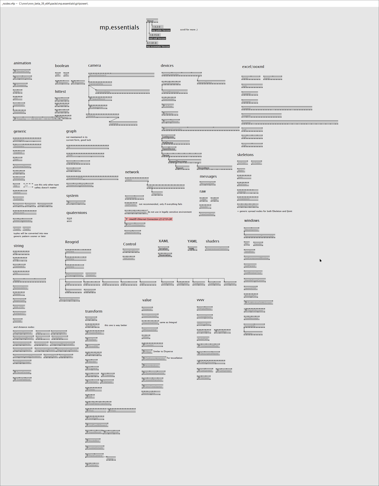

<tocmd>
- **[Unreal plugins](#unreal-plugins)**
- **[vvvv plugins](#vvvv-plugins)**
- **[programs](#programs)**
</tocmd>

# Unreal plugins

## Uranium

The fastest full CEF implementation for UE4 so far.

### [Get it](https://github.com/microdee/Uranium)

* Use mostly everything what CEF can offer, translated to an Unreal friendly API.
* Off-screen rendering result is retrieved through a shared texture on graphics memory. This means no rendering overhead for high resolution HTML content.
  * Above allows to have Browser Atlas pipeline: a large canvas of HTML is used to render many in-game UI elements, just like a regular texture atlas.
* Full multitouch capability.
* Integration into Unreal's own audio system.
* UMG abstraction layer, a full fledged browser widget.

**Recently open-sourced. It started development at [MESO](https://meso.design)**  
**Now being developed at [realworld one](https://realworld-one.com/)**  
A lot of enhancements and features are planned, but the basic components are already usable.

----

## SpaceMouse for Unreal Engine

Control Editor viewports with the best camera control device out there, even without the official drivers.

### [Get it](https://github.com/microdee/UE4-SpaceMouse) | [Buy it](https://www.unrealengine.com/marketplace/en-US/product/spacemouse-for-unreal-engine)

----

## Nuke.Unreal

High level project automations for UE4 in C#, using the [Nuke build tool](https://nuke.build).

### [Get it](https://github.com/microdee/Nuke.Unreal)

----

## UE4 Material Expression node Generator

This is a VS Code plugin to generate custom material expression nodes and their boilerplate for UE4 to the clipboard, ready to be pasted in the material editor.

Get it via the extensions panel in VS Code or,  
[Check out the source code](https://github.com/microdee/ue4-material-expression-generator)

----

## Buest \[byːst\]

A shared, managed and IWYU dependency on [Boost](https://www.boost.org/) for your C++ plugins and projects. No need to deal with manual installation of Boost and its BCP tool.

### [Get it](https://github.com/microdee/Buest)

----
# VVVV plugins

## VPM
Vvvv Package Manager

Decentralized package manager for vvvv. Without it, contribution dependency is a completely manual endeavour in vvvv.

### [Get it](https://vvvvpm.github.io)

----

## Notuiv
Advanced UI interaction library in 3D space.

### [Get it](https://vvvv.org/contribution/notuiv)

<iframe src="https://player.vimeo.com/video/268043752?color=ffffff&amp;title=0&amp;byline=0&amp;portrait=0" width="640" height="370" frameborder="0" webkitallowfullscreen="" mozallowfullscreen="" allowfullscreen=""></iframe>

----

## Vanadium
Industry-proof, fast and GPU accelerated HTML renderer for vvvv using a custom build of CEF (Chromium Embedded Framework).

### [Get it](https://github.com/meso-unimpressed/Vanadium)

----

## mp.dx
and mp.essentials

A large collection of general purpose nodes and ecosystems. Think of it as a second addonpack. It also includes as dependencies:

* **[mp.fxh](https://github.com/microdee/mp.fxh)** a HLSL header library tackling many common problems
* **[mp.pddn](https://github.com/microdee/mp.pddn)** a library to ease manipulation of nodes and pins in vvvv.
* **[md.stdl](https://github.com/microdee/md.stdl)** a C# standard library of misc things.
  * This is being deprecated tho in favor of its .NET Core port which doesn't rely on VVVV.Utils anymore

### [Get it](https://vvvv.org/contribution/mp.dx)

----
# programs

## WootingPiano

Little program converting the Wooting keyboard analog key-presses to expressive MIDI messages (per-note and per-channel after-touch or MIDI controls).

### [Get it](https://github.com/simon-wh/WootingPiano/releases)

<iframe width="560" height="315" src="https://www.youtube-nocookie.com/embed/JXBlBfzc5S0" frameborder="0" allow="accelerometer; autoplay; encrypted-media; gyroscope; picture-in-picture" allowfullscreen></iframe>
