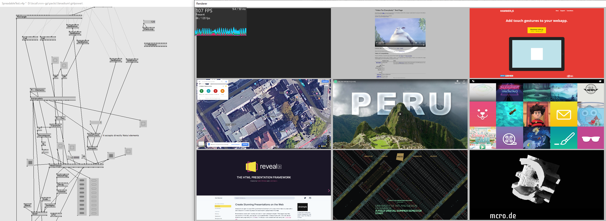
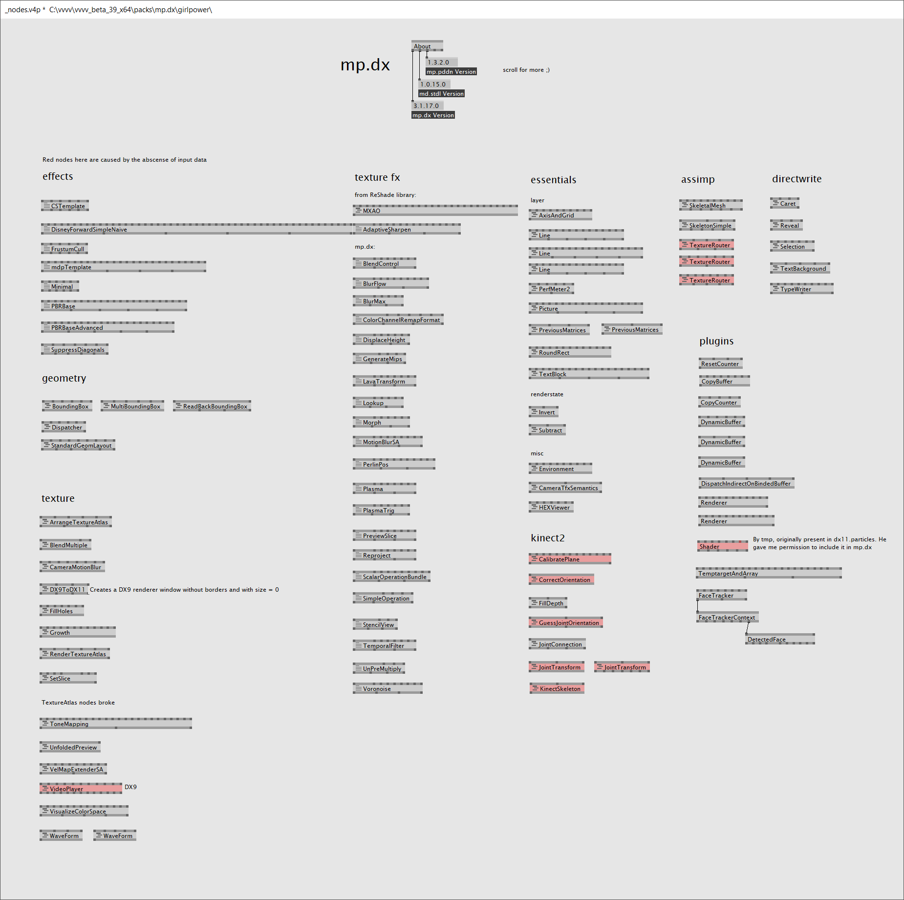

<tocmd>

- **[Unreal plugins](#unreal-plugins)**
- **[vvvv plugins](#vvvv-plugins)**
- **[programs](#programs)**

</tocmd>

# Unreal plugins

## [SpaceMouse for Unreal Engine](https://github.com/microdee/UE4-SpaceMouse)

Control Editor viewports with the best camera control device out there, even without the official drivers.

----

## [Nuke.Unreal](https://github.com/microdee/Nuke.Unreal)

High level project automations for Unreal Engine in C#, using the great [Nuke build tool](https://nuke.build).

* Use Unreal tools from command line and in CI/CD
* Generate boilerplates
* Implicitly composable execution graph
* Fluent API UBT/UAT wrappers in C#
* Install C++ libraries with ease
* And more!

----

## [Nuke.Cola](https://github.com/microdee/md.Nuke.Cola)

Generic extensions for [Nuke build tool](https://nuke.build).

* Compose builds with automatically discovered plugins
* Manipulate file/folder structures with expressive declarative syntax
* `Tool` delegate composition

----

## [MCRO](https://mcro.de/mcro??literal)

A C++ utilities library for Unreal Engine for writing code in style for a more civilised age.

----

## Uranium

A fast multi-backend web-browser/HTML-renderer for Unreal Engine.

### Coming soon™️

Currently this is under major redesign.

----

## UE4 Material Expression node Generator

This is a VS Code plugin to generate custom material expression nodes and their boilerplate for UE4 to the clipboard, ready to be pasted in the material editor.

Get it via the extensions panel in VS Code or,  
[Check out the source code](https://github.com/microdee/ue4-material-expression-generator)

----
# VVVV plugins

## [VPM](https://vvvvpm.github.io)
Vvvv Package Manager

Decentralized package manager for vvvv. Without it, contribution dependency is a completely manual endeavour in vvvv.

----

## [Notuiv](https://vvvv.org/contribution/notuiv)
Advanced UI interaction library in 3D space.

<iframe src="https://player.vimeo.com/video/268043752?color=ffffff&amp;title=0&amp;byline=0&amp;portrait=0" width="640" height="370" frameborder="0" webkitallowfullscreen="" mozallowfullscreen="" allowfullscreen=""></iframe>

----

## [Vanadium](https://github.com/meso-unimpressed/Vanadium)
Industry-proof, fast and GPU accelerated HTML renderer for vvvv using a custom build of CEF (Chromium Embedded Framework).

----

## [mp.dx](https://vvvv.org/contribution/mp.dx)
and mp.essentials

A large collection of general purpose nodes and ecosystems. Think of it as a second addonpack. It also includes as dependencies:

* **[mp.fxh](https://github.com/microdee/mp.fxh)** a HLSL header library tackling many common problems
* **[mp.pddn](https://github.com/microdee/mp.pddn)** a library to ease manipulation of nodes and pins in vvvv.
* **[md.stdl](https://github.com/microdee/md.stdl)** a C# standard library of misc things.
  * This is being deprecated tho in favor of its .NET Core port which doesn't rely on VVVV.Utils anymore

----
# programs

## [WootingPiano](https://github.com/simon-wh/WootingPiano/releases)

Little program converting the Wooting keyboard analog key-presses to expressive MIDI messages (per-note and per-channel after-touch or MIDI controls).

<iframe width="560" height="315" src="https://www.youtube-nocookie.com/embed/JXBlBfzc5S0" frameborder="0" allow="accelerometer; autoplay; encrypted-media; gyroscope; picture-in-picture" allowfullscreen></iframe>
