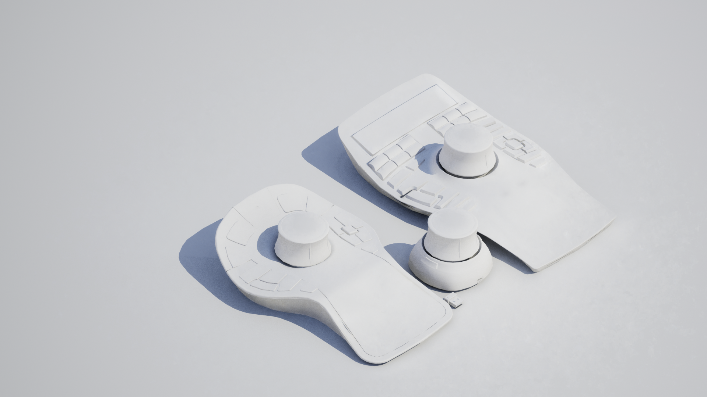

## Uranium

The fastest full CEF implementation for UE4 so far, embracing recent features of CEF's Off-screen rendering mode.

### [Get it](https://github.com/microdee/Uranium)

* Use mostly everything what CEF can offer, translated to an Unreal friendly API.
* Off-screen rendering result is retrieved through a shared texture on graphics memory. This means no rendering overhead for high resolution HTML content.
  * Above allows to have Browser Atlas pipeline: a large canvas of HTML is used to render many in-game UI elements, just like a regular texture atlas.
* Full multitouch capability.
* Integration into Unreal's own audio system.
* UMG abstraction layer, a full fledged browser widget.

**Recently open-sourced. It started development at MESO**  
A lot of enhancements and features are planned, but the basic components are already usable.

----

## SpaceMouse for Unreal Engine

Control Editor viewports with the best camera control device out there, even without the official drivers.

### [Get it](https://github.com/microdee/UE4-SpaceMouse) | [Buy it](https://www.unrealengine.com/marketplace/en-US/product/spacemouse-for-unreal-engine)

----

## UE4 Material Expression node Generator

This is a VS Code plugin to generate custom material expression nodes and their boilerplate for UE4 to the clipboard, ready to be pasted in the material editor.

Get it via the extensions panel in VS Code or,  
[Check out the source code](https://github.com/microdee/ue4-material-expression-generator)

----

## Buest \[byːst\]

A shared, managed and IWYU dependency on [Boost](https://www.boost.org/) for your C++ plugins and projects. No need to deal with manual installation of Boost and its BCP tool.

### [Get it](https://github.com/microdee/Buest)

----

# Coming Soon™

## BlueKinect

Industry-proof and versatile implementation of Azure Kinect into UE4. Main features are:

* Support for any number of local or remote devices.
* Support for any number of tracked people.
* Zero-config network discovery and sharing data of remote Kinect Azure devices.
  * Especially engineered with nDisplay clusters in mind, however BlueKinect doesn't use nDisplay event system. It uses its own UDP communication.
* MVP pattern for Kinect's input data, with runtime, dynamic templates for presenter/view classes.
* View classes and utilities for avateering skeletal meshes.
* Retrieve camera images efficiently. Upload only color and raw depth to graphics memory from Kinect Azure SDK, calculate the rest with compute-shaders.
  * (images are not yet shared across the network)

**Currently being developed at MESO.**  
It's already used and well tested in one of our large-scale interactive projects at MESO.

----

## BlueWindow

Manage multiple UMG windows from Blueprint and other UI related features.

* Create windows managed by an actor component. It's being used for multi-display scenarios, where nDisplay would be too bloaty, or too attended.
* Utilities for complex multitouch interactions.
* UMG utilities for better preview at design time.

**Currently being developed at MESO.**  
It's already being used almost in all of our complete and running projects at MESO.