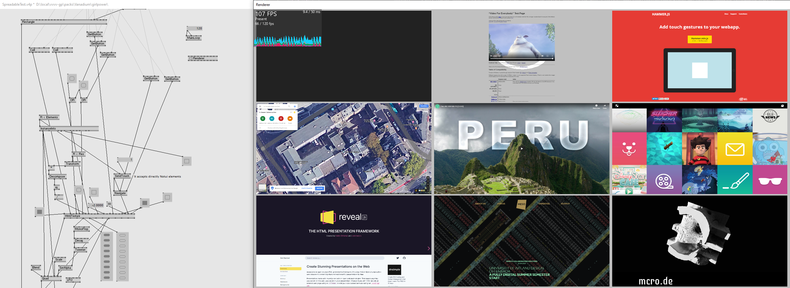
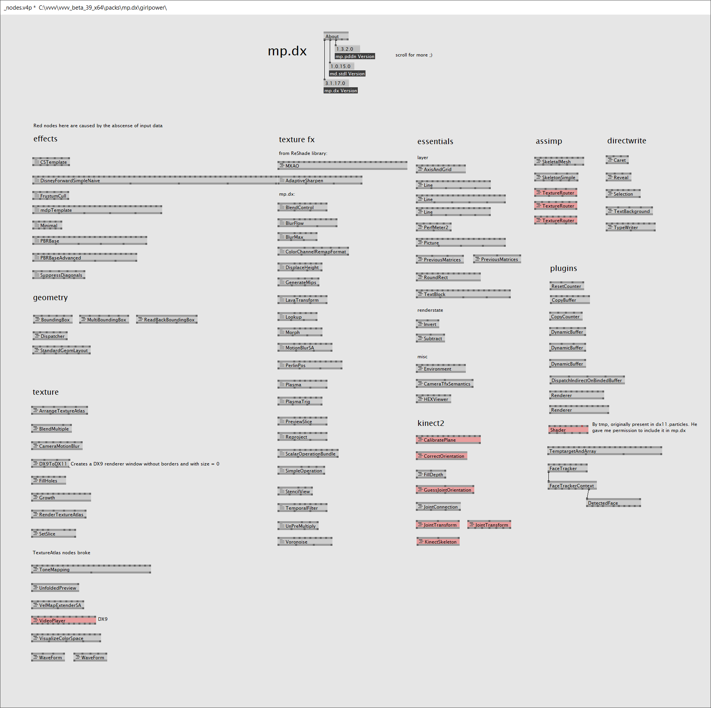
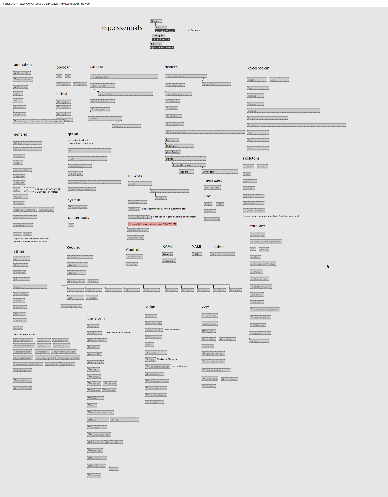

## VPM
Vvvv Package Manager

Decentralized package manager for vvvv

## [Get it](https://vvvvpm.github.io)

----

## Notuiv
Advanced UI interaction library in 3D space.

<iframe src="https://player.vimeo.com/video/268043752?color=ffffff&amp;title=0&amp;byline=0&amp;portrait=0" width="640" height="370" frameborder="0" webkitallowfullscreen="" mozallowfullscreen="" allowfullscreen=""></iframe>

## [Get it](https://vvvv.org/contribution/notuiv)

----

## Vanadium
Industry-proof, fast and GPU accelerated HTML renderer for vvvv using a custom build of CEF (Chromium Embedded Framework).

## [Get it](https://github.com/meso-unimpressed/Vanadium)

----

## mp.dx
and mp.essentials

A large collection of general purpose nodes and ecosystems. Think of it as a second addonpack. It also includes as dependencies:

* **[mp.fxh](https://github.com/microdee/mp.fxh)** a HLSL header library tackling many common problems
* **[mp.pddn](https://github.com/microdee/mp.pddn)** a library to ease manipulation of nodes and pins in vvvv.
* **[md.stdl](https://github.com/microdee/md.stdl)** a C# standard library of misc things.
  * This is being deprecated tho in favor of its .NET Core port which doesn't rely on VVVV.Utils anymore

## [Get it](https://vvvv.org/contribution/mp.dx)