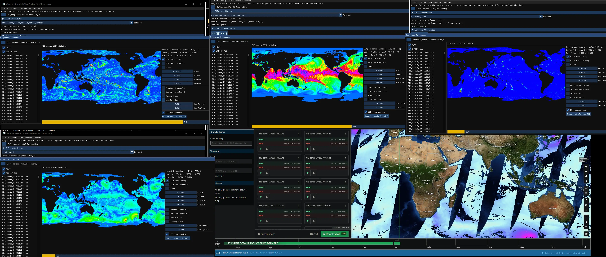

## [What Lies Beneath](https://susankosti.com/project/vividsydney2023) @ [VIVID Sidney](https://www.vividsydney.com) 2023

by **[Susan Kosti](https://susankosti.com)** and **[Kati Katona](https://katikatona.com)**  
2023

**Role:** C++ programming.

For this project I've been asked to gather time-lapse global scientific data from NASA databases about how our climate is changing. That data was used to drive the VFX in the awe-inspiring light installation created by [Susan Kosti](https://susankosti.com) and [Kati Katona](https://katikatona.com). The program automatically fetches an HD5 sequence from a data-set and converts the selected data channels from it into EXR sequence which then could be used in the VFX graph.

The highest resolution data set used was approximately 40,000 x 20,000 pixels large and the output sequence was spanning accross 3.5 TB.